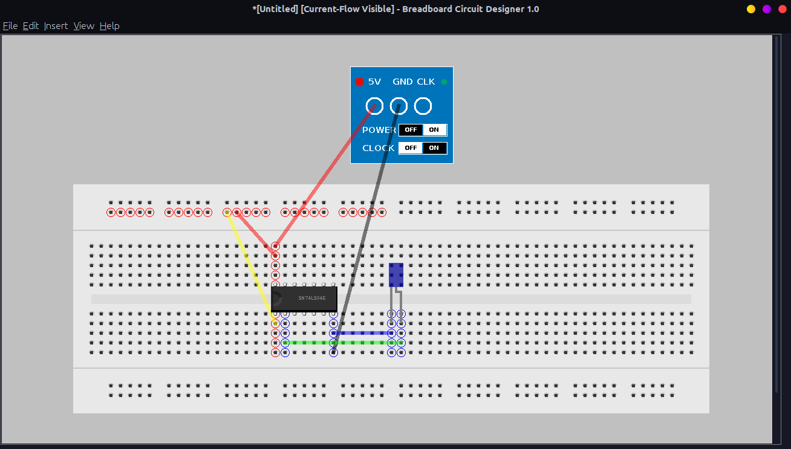

Breadboard Circuit Designer
===========================

A circuit designer using breadboards, ICs, resistors, and LEDs. Written in Java, not only can you design the circuit, but you can simulate the inputs and watch the outputs as well.

### Browsing the Code

Open the `BreadboardCircuitDesigner` directory under `src` in Netbeans to view the code.

### Usage example

```bash
$ cd src/BreadboardCircuitDesigner/dist
$ java -jar BreadboardCircuitDesigner.jar
```

### Screenshot



### License

The application is licensed under the MIT License. Copyright &copy; Akash Nag.